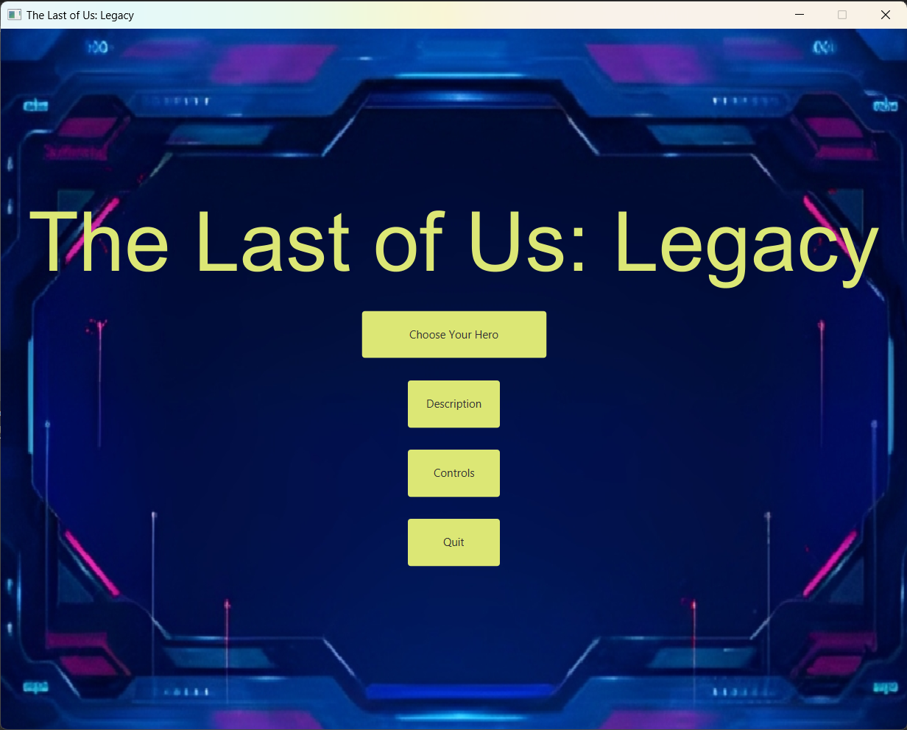
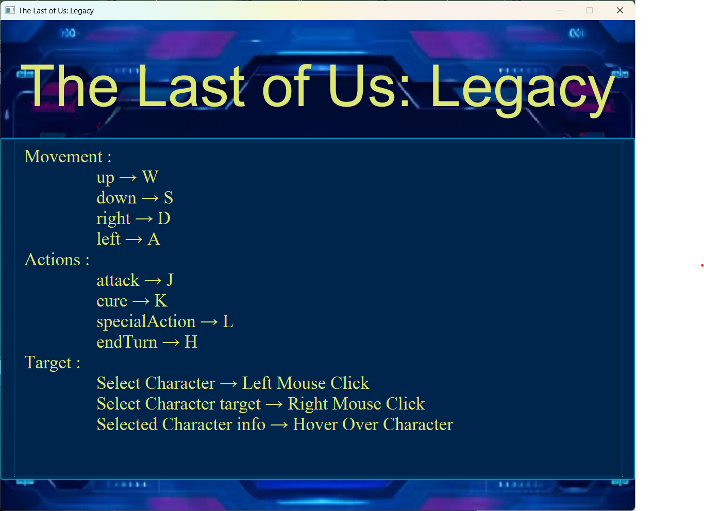
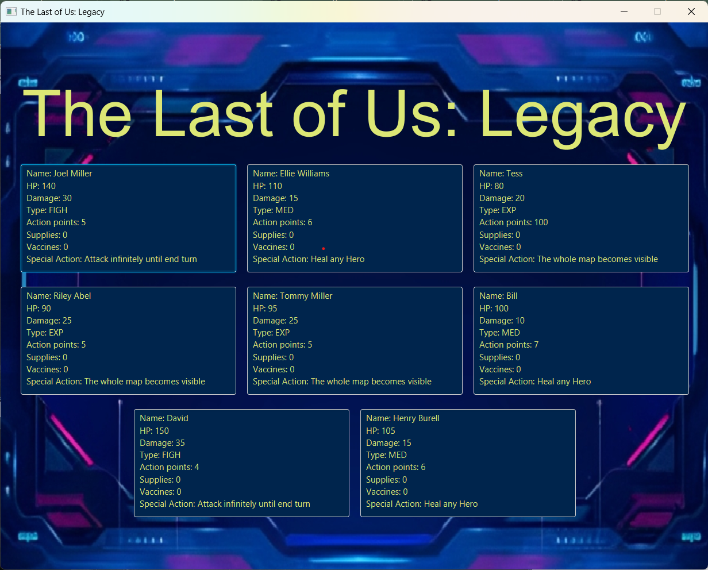
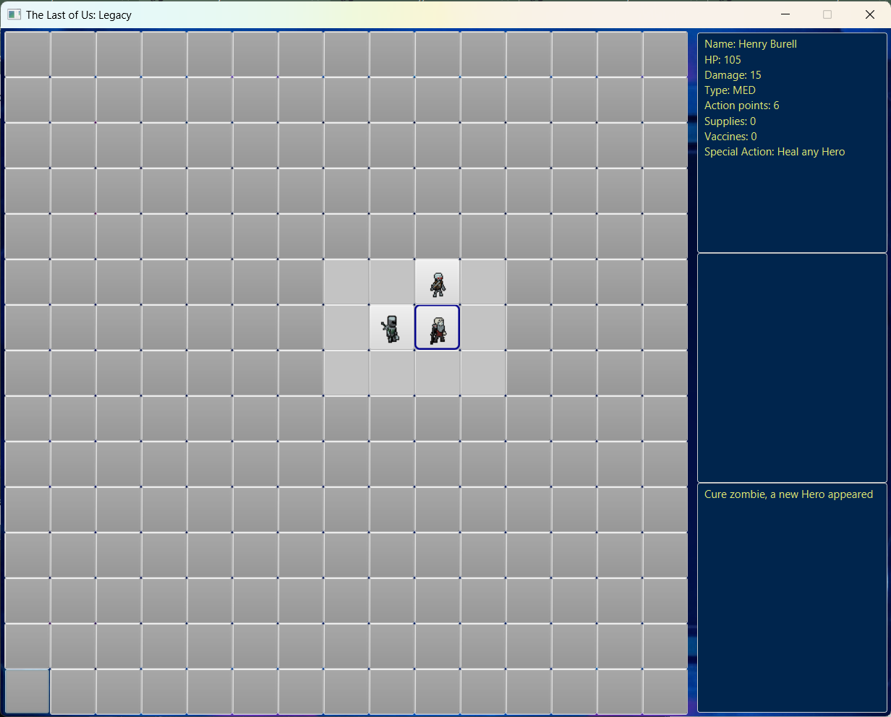

# The-Last-of-Us-Legacy

## Description
The Last of Us: Legacy is a single player survival game set in a zombie apocalyptic world.
The game is conducted in a turn based manner, in which each player character receives a specific
number of action points per turn, which they can use to move, attack or cure zombies, or use
special actions.
The player starts the game controlling only one hero, but can gain additional heroes by curing
zombies. The objective of the game for the player is to survive as long as it takes in order to
cure a sufficient number of zombies enough to build a community to survive the apocalypse.

---

## Preview

---

## Dependencies
* Java used:  17.0.5
* JavaFx
* JUnit (not necessary)
* Add this to vm-arguments: `--module-path="/path/to/javafx-sdk/lib" --add-modules=javafx.controls,javafx.fxml,javafx.media`

---

## Team Members
* Ahmed Gado
* Rasheed Atia
* Mostafa Hisham